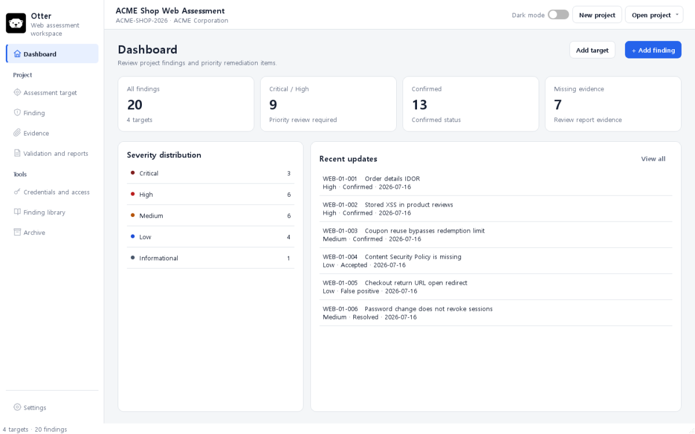
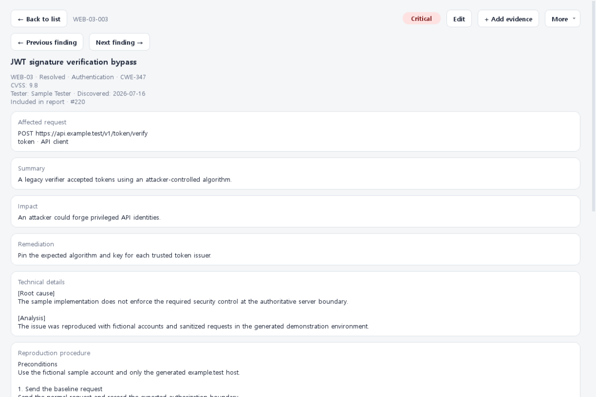
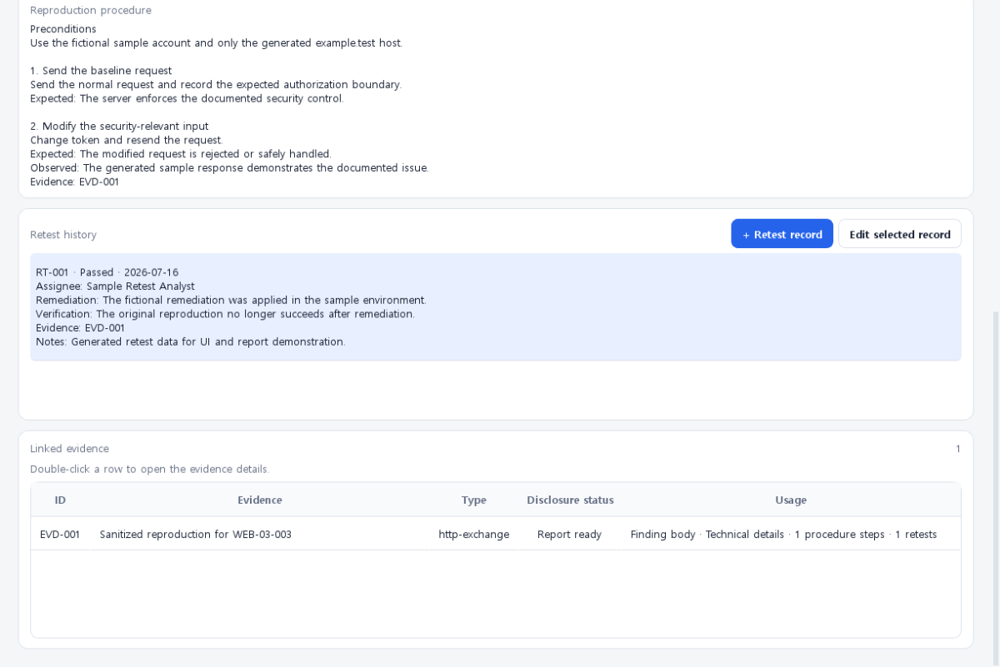
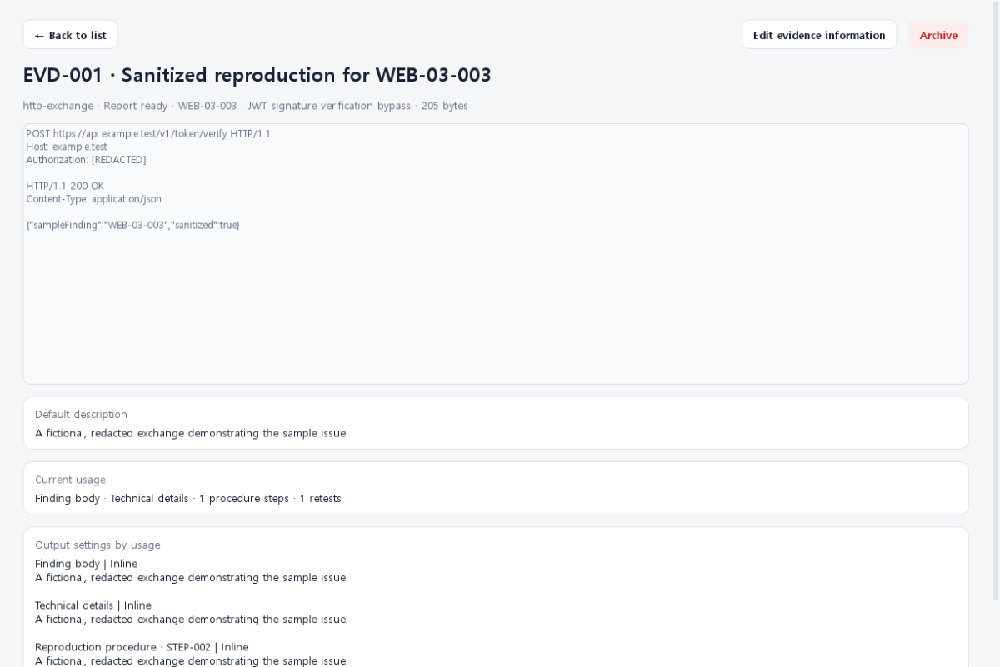
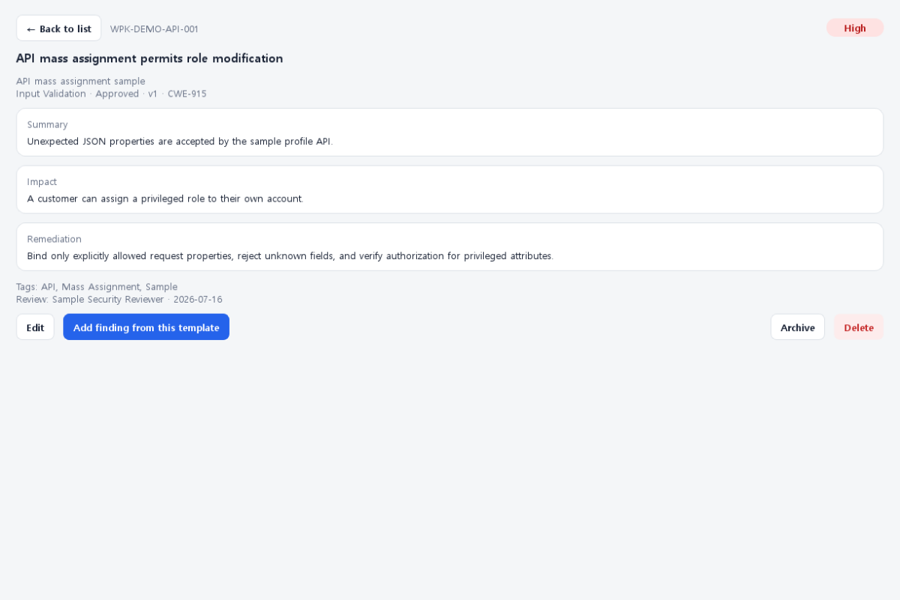
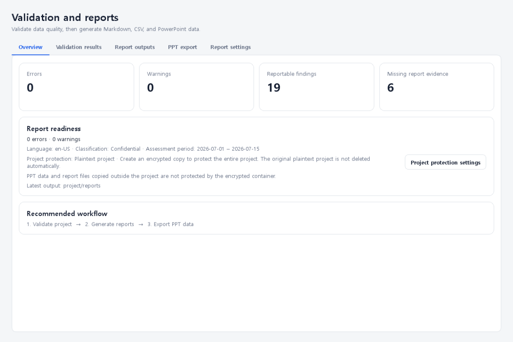
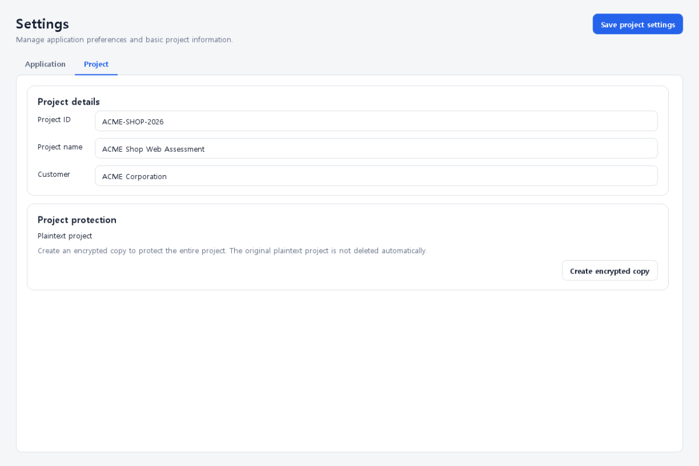

<div align="center">
  
  <h1>Otter</h1>
  <p><strong>From finding to delivery, with every piece of evidence traceable.</strong></p>
  <p>A portable, local-first desktop workspace for authorized web security assessments.</p>
  <p>
    <a href="https://github.com/i44n/Otter/releases/tag/v0.1.0b1"></a>
    <a href="https://github.com/i44n/Otter/actions/workflows/ci.yml"></a>
    
    
    
    <a href="LICENSE"></a>
  </p>
</div>

> [!WARNING]
> Otter is in public beta. Back up important work and expect project formats and
> workflows to change before 1.0. Pre-beta projects are not migrated automatically.



Otter is built for consultants and small security teams that want disciplined
assessment records without operating a shared web platform. A project keeps its
targets, findings, procedures, evidence, retests, and delivery settings together
as auditable files, and can be sealed into a portable encrypted `.wpkproj`
container.

Instead of treating evidence as an attachment added at the end, Otter records why
each asset is used: in the finding narrative, technical analysis, a reproduction
step, or a retest. The same traceable record drives validation and every output.

Otter organizes human-led assessment work. It does **not** scan targets, import
scanner fleets, or run attacks.

## Why Otter?

- **Finding-to-evidence traceability** — keep affected requests, impact,
  remediation, analysis, procedures, retests, and evidence usage in one record.
- **Evidence without duplication** — classify an asset once, then reuse it across
  narrative, technical, procedure, and retest scopes with a caption and placement
  specific to each usage.
- **A delivery gate, not just an export button** — validate required content,
  evidence disclosure, broken links, and project security before generating files.
- **Portable security boundaries** — work without a server, encrypt the complete
  project, and keep assessment credentials in a separately authenticated vault.
- **Auditable, regenerable outputs** — readable project files remain the source of
  truth; Markdown, CSV, validation, and presentation material are derived outputs.
- **Reusable reviewed knowledge** — maintain a searchable, versioned finding
  library without mixing customer data into the knowledge database.

## Where Otter fits

Otter deliberately chooses a different operating model from server-centric
vulnerability managers and collaborative report portals.

| Design question | Otter's answer |
|---|---|
| Where does assessment data live? | In a portable local project, optionally sealed as an encrypted `.wpkproj` file. |
| What is the primary unit of work? | A tester-authored finding with procedures, retests, and explicit evidence links. |
| How is evidence handled? | As a reusable asset with independent disclosure classification and scope-specific usage metadata. |
| When is output checked? | Before delivery, through structural, content, evidence-policy, and project-security validation. |
| What owns the source of truth? | Auditable JSON and evidence files; generated reports can be rebuilt. |
| What infrastructure is required? | A desktop Python environment—no application server, PostgreSQL, Docker, or user administration. |

Otter is a strong fit for offline or on-site work, solo consultants and small
teams, evidence-heavy web assessments, and engagements where credentials and raw
evidence should not leave the operator's machine. A server platform is likely a
better fit when you need real-time multi-user editing, enterprise remediation
tracking, scanner aggregation, SSO/RBAC, or portfolio-wide dashboards.

## See the workflow

### Keep the complete finding in one place

Capture the affected request, business impact, remediation, root cause, analysis,
and reproduction procedure as structured data instead of scattering notes across
documents.



### Retest at finding level and keep the evidence trail

Record each remediation check against the finding, preserve the verification
history, and see exactly where every linked evidence item is used.



### Reuse evidence without duplicating request and response text

HTTP exchanges and other evidence remain independent assets. Otter shows their
disclosure status, linked finding, and output settings for every usage.



### Turn reviewed guidance into new findings

Maintain reusable vulnerability summaries, impact statements, remediation advice,
CWE references, tags, review metadata, and history in the finding library.



### Validate before delivery

Review data-quality and evidence-policy issues, confirm deliverable readiness,
generate Markdown and CSV outputs, and produce a final PowerPoint file from a
registered company template. Template setup lives in a global workspace; deck
generation and review stay with the project deliverables.



### Protect local assessment data

Create an encrypted project copy, rotate its password, and create verified backups
from the project settings. Exported report files are intentionally treated as
separate deliverables and are not protected by the project container.



## Quick start

Requirements:

- Python 3.10 or newer
- Windows or macOS

### Windows

```powershell
git clone https://github.com/i44n/Otter.git
cd Otter
python -m venv .venv
.\.venv\Scripts\Activate.ps1
python -m pip install -r requirements.txt
python .\otter.py gui
```

### macOS

```bash
git clone https://github.com/i44n/Otter.git
cd Otter
python3 -m venv .venv
source .venv/bin/activate
python3 -m pip install -r requirements.txt
python3 ./otter.py gui
```

### Explore the fictional sample

The generated ACME project uses only `example.test` hosts and fictional evidence.

```powershell
python .\examples\create_sample.py --force
python .\examples\open_sample_gui.py
```

## Typical assessment flow

1. Create a project and register assessment targets.
2. Add findings directly or start from the finding library.
3. Record technical analysis and reproducible steps.
4. Add evidence once and link it to the scopes where it is used.
5. Record finding-level retests with supporting evidence.
6. Review deliverable readiness and resolve security or content issues.
7. Generate Markdown/CSV documents and data or export the legacy PPT-ready bundle.
8. Prepare a company PPTX in project-independent **Shared libraries > PowerPoint templates**,
   then select it under project **Deliverables**, review the render plan, and
   create the final `.pptx`.

## Outputs

Otter currently generates:

- final and summary Markdown reports;
- target and finding summaries;
- findings CSV;
- a localized validation report;
- a presentation-ready folder with `slides.json`, SVG charts, finding content,
  and curated report-ready evidence for backward compatibility;
- a template-driven final `.pptx` plus a render manifest containing template,
  profile, Report IR, plan hashes, page provenance, and warnings.

PPT Studio exposes only reserved roles and semantic slots, derives binding
types automatically, previews slide geometry, and stores reusable profiles in an
application-level linked-template library. Profile format v5 supports one to
twelve procedure content regions and optional story-level layout-set selection.
Text capacity is estimated numerically per mapped shape and checked against the
actual slot text. Page types describe primary/continuation/static pages and
evidence capacity; Story flow orders fixed roles. Profile v1/v2/v3/v4 files are migrated and unsupported legacy
mappings are quarantined for review.

Finding results are modeled independently from procedure steps. Link each evidence
asset once to its result, procedure step, technical detail, retest, appendix, or
attachment usage. Plan format v2 keeps ordered content blocks on each page, so the
planner can form variable procedure groups such as `2·1·1·2·1` and add continuation
slides only when mapped text or evidence capacity requires them.

The template-driven renderer supports mapped text and image shapes, including
ordinary rectangle/text shapes used as evidence frames. Charts, OLE/think-cell,
SmartArt, and animations are preserve-only until explicit editing support is
implemented.

## Project and security model

Project source files are readable JSON and evidence files so they remain auditable.
The current internal project schema is version 3; this is independent of the Otter
application version.

Only linked evidence classified as report-ready is emitted to deliverables.
Automated secret detection is a safeguard, not a replacement for human review.
Keep recovery keys offline, use full-disk encryption, and never commit customer
projects, credentials, target URLs, or raw evidence.

Please report suspected vulnerabilities privately according to
[SECURITY.md](SECURITY.md). Do not open a public issue for a security vulnerability.

<details>
<summary>Project layout</summary>

```text
project/
├─ project.json
├─ report-config.json
├─ targets/
│  └─ WEB-01-.../
│     ├─ target.json
│     └─ findings/
│        └─ WEB-01-001-.../
│           ├─ finding.json
│           ├─ procedure.json
│           ├─ retests.json
│           └─ evidence/
│              ├─ evidence.json
│              ├─ links.json
│              └─ files/
└─ archive/
```

</details>

## Beta status

The current public development version is `0.1.0b1`.

- Project schemas and workflows may change before 1.0.
- Pre-beta project migrations are intentionally not provided.
- Human review is required before sharing generated deliverables.
- Packaging, signed installers, and automatic updates are not yet part of the beta.

## Documentation

- [Documentation index / 문서 목록](docs/README.md)

| Topic | English | Korean |
|---|---|---|
| User guide | [English](docs/USER_GUIDE_EN.md) | [한국어](docs/USER_GUIDE.md) |
| GUI design system | [English](docs/GUI_DESIGN_EN.md) | [한국어](docs/GUI_DESIGN.md) |
| Secure projects and threat model | [English](docs/SECURE_PROJECTS_EN.md) | [한국어](docs/SECURE_PROJECTS.md) |
| Procedure and retest model | [English](docs/PROCEDURES_EN.md) | [한국어](docs/PROCEDURES.md) |
| Localization | [English](docs/LOCALIZATION_EN.md) | [한국어](docs/LOCALIZATION.md) |
| Development guide | [English](docs/DEVELOPMENT_EN.md) | [한국어](docs/DEVELOPMENT.md) |

- [Architecture](DESIGN.md)
- [Changelog](CHANGELOG.md)

## Development

```powershell
python -m unittest discover -s tests -v
python -m compileall -q webpentestkit tests examples tools
python .\examples\create_sample.py --force
python .\tools\capture_readme_screenshots.py
python .\otter.py validate --project .\examples\generated\acme-shop\project
```

The GUI uses the same service layer as the CLI. Views do not write JSON, SQLite,
or evidence files directly. See [CONTRIBUTING.md](CONTRIBUTING.md) before submitting
a change.

## Community

- Use GitHub Issues for reproducible bugs and focused feature requests.
- Use fictional data in public issues and pull requests.
- Include tests for behavior changes.
- Follow the [Code of Conduct](CODE_OF_CONDUCT.md).

## License

Otter is released under the [MIT License](LICENSE).

---

Use Otter only on systems you own or are explicitly authorized to assess.
