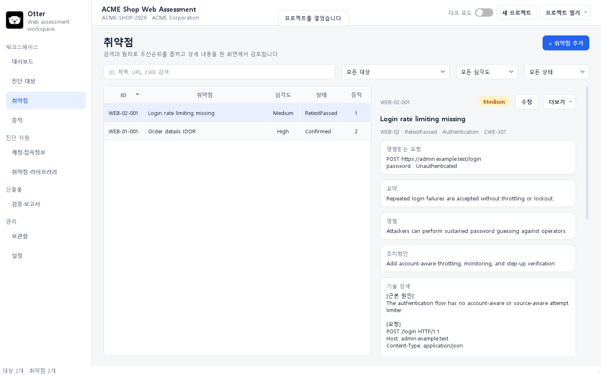
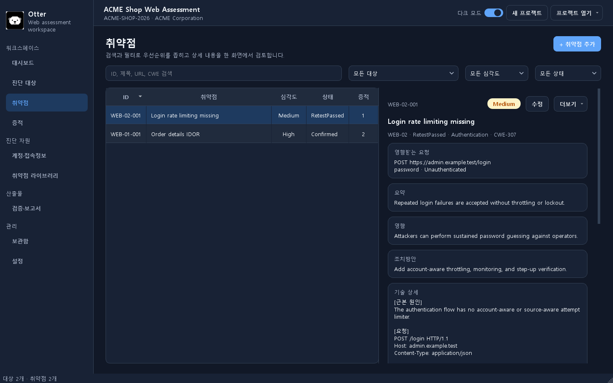

<div align="center">
  
  <h1>Otter</h1>
  <p><strong>A local-first workspace for authorized web security assessments.</strong></p>
  <p>
    
    
    
    
    <a href="LICENSE"></a>
  </p>
</div>



Otter helps penetration testers keep targets, findings, reproduction procedures,
evidence, retest history, assessment credentials, and report-ready content in one
structured desktop workspace. Project data stays local by default and can be
sealed into an encrypted `.wpkproj` container.

Otter is a project and evidence management tool. It does not scan targets or run
attacks.

## Why Otter?

- **Structured findings** — impact, remediation, technical details, procedures,
  and multi-round retests share one data model.
- **Evidence you can audit** — keep sensitive originals separate from redacted,
  report-approved evidence and link files to individual procedure steps.
- **Local-first security** — no server is required; project containers and the
  credential vault use authenticated encryption with password and recovery-key
  workflows.
- **Reusable knowledge** — maintain a versioned vulnerability library and move it
  between installations with atomic JSON import/export.
- **Report-ready output** — generate validation results, Markdown/CSV reports, and
  a layout-independent PPT data bundle with `slides.json` and curated evidence.
- **Native desktop workflow** — modern PySide6 interface with light/dark themes,
  keyboard navigation, archive/restore, and background report jobs.

## Screenshots

| Light | Dark |
| --- | --- |
|  |  |

## Quick start

Requirements:

- Python 3.10 or newer
- Windows or macOS

From a cloned checkout:

```powershell
python -m venv .venv
.\.venv\Scripts\Activate.ps1
python -m pip install -r requirements.txt
python .\otter.py gui
```

On macOS:

```bash
python3 -m venv .venv
source .venv/bin/activate
python3 -m pip install -r requirements.txt
python3 ./otter.py gui
```

To explore a fictional project without entering data manually:

```powershell
python .\examples\create_sample.py --force
python .\otter.py gui --project .\examples\generated\acme-shop\project
```

## Typical workflow

1. Create a project and register one or more assessment targets.
2. Add findings directly or start from the vulnerability library.
3. Record impact, remediation, technical request/response details, and
   reproducible steps.
4. Attach sanitized report evidence and keep sensitive originals out of output.
5. Record each retest with per-step outcomes and evidence.
6. Validate the project, generate reports, and export the PPT-ready bundle.

## Project format

Project files are intentionally readable and versionable. Generated reports and
exports are derived output and should not be edited as source data.

```text
project/
├─ project.json
├─ report-config.json
├─ targets/
│  └─ WEB-01-.../
│     ├─ target.json
│     └─ findings/
│        └─ WEB-01-001-.../
│           ├─ finding.json
│           ├─ procedure.json
│           ├─ retests.json
│           └─ evidence/
│              ├─ evidence.json
│              ├─ raw/
│              └─ report/
└─ archive/
```

## Security model

Otter is designed for authorized security work involving sensitive customer
data. Report inclusion is denied for evidence marked sensitive, but automated
detection is only a safeguard—not a replacement for human review. Keep recovery
keys offline, use full-disk encryption, and never commit real assessment projects
or raw evidence to Git.

Please report vulnerabilities privately according to [SECURITY.md](SECURITY.md).
Do not open a public issue for a suspected security vulnerability.

## Documentation

- [User guide (한국어)](docs/USER_GUIDE.md)
- [Secure projects and threat model](docs/SECURE_PROJECTS.md)
- [Procedure and retest model](docs/PROCEDURES.md)
- [Development guide](docs/DEVELOPMENT.md)
- [Architecture](DESIGN.md)
- [Changelog](CHANGELOG.md)

## Development

```powershell
python -m unittest discover -s tests -v
python -m compileall -q webpentestkit tests examples
python .\examples\create_sample.py --force
python .\otter.py validate --project .\examples\generated\acme-shop\project
```

The GUI talks to the same service layer as the CLI. Views must not write JSON,
SQLite, or evidence files directly. See [CONTRIBUTING.md](CONTRIBUTING.md) before
submitting a change.

## Community

- Use GitHub Issues for reproducible bugs and focused feature requests.
- Use the pull request template and include tests for behavior changes.
- Follow the [Code of Conduct](CODE_OF_CONDUCT.md).
- For usage questions, see [SUPPORT.md](SUPPORT.md).

## License

Otter is released under the [MIT License](LICENSE).

---

Use Otter only on systems you own or are explicitly authorized to assess.
